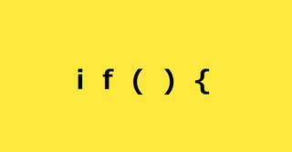

## Eye-catches from Maid-dragon

The HTML/JavaScript code here imitates the eye-catches, or commercial bumpers, from “Miss Kobayashi's Dragon Main” (『[小林さんちのメイドラゴン](https://maidragon.jp/)』). The example below is from the 5th Episode.

All the eye-catch shots consist of 5 letters, displayed one by one at a short interval (roughly 600 ms) with clicking sounds, on a plain yellow background. The letters hint somethig, most likely, related to the episode. For example, the 5th episode dipicts Kobayashi-san at work (she is a Pythonista), hence something related to programming.

The code was originally posted to [Qiita](https://qiita.com/stoyosawa/items/4bf019ae08082b811721). Click [here](
https://html-preview.github.io/?url=https://github.com/stoyosawa/Kobayashi-San/blob/main/240701-eyecatch.html) to see the code in action.

